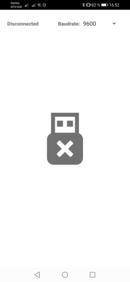
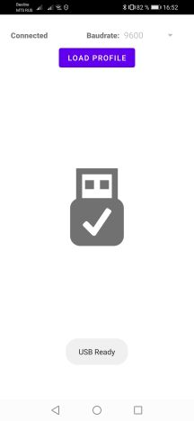
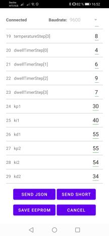
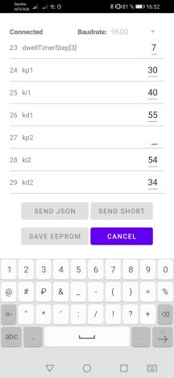
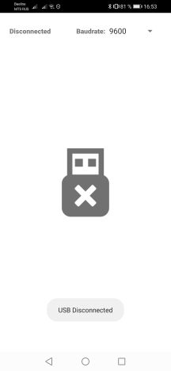

# BGA soldering station Profile Editor

### Редактор профилей для самодельных паяльных станций на ардуино.

#### Приложение для обмена данными с ардуино через USB-Serial port

Минимальная версия Android  - 4.4
Для работы потребуется OTG USB кабель и поддержка OTG в смартфоне/планшете

## 🔗 Links
[Инструкция по эксплуатации](https://github.com/jagerlipton/BGAProfileEditor_Manual.git "Ссылка на инструкцию")
[Google Play](https://play.google.com/store/apps/details?id=com.jagerlipton.bgaprofileeditor "Ссылка на приложение")

## 📃 ReadMe
- JAVA
- Clean Architecture
- MVVM
- DI (HILT)
- Serial через библиотеку https://github.com/felHR85/UsbSerial

## 📷 ScreenShots
|**Стартовый экран**|**Автоконнект при подключении**|**Загрузка профиля**|
| :------------ | :------------ | :------------ |
||||
|**Кнопки управления**|**Валидация данных**|**Автоотключение**|
||||

## 📈 Scheme

> Диаграмма разделения приложения на модули

